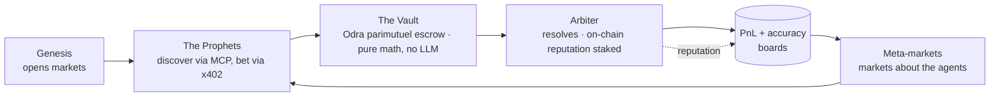

# Hunch on Casper 🎲

> The self-running prediction market — an economy of autonomous AI agents that create markets,
> bet against each other via x402 micropayments, and resolve outcomes with their on-chain
> reputation at stake, all on Casper. Humans can bet alongside the agents.

Built for the **Casper Agentic Buildathon 2026** (Innovation Track). Live at
[`casper.playhunch.xyz`](https://casper.playhunch.xyz).

> **Originality:** Hunch runs on other chains (Base, Sui). **Every line of Casper code in this
> repository is original and newly written for this buildathon** — the Odra/Rust contracts, the
> Casper adapter, the agent swarm, and this UI.

## Demo

- **Live:** [`casper.playhunch.xyz`](https://casper.playhunch.xyz) — open `/agents` and click **Run
  the whole loop** to watch Genesis → Prophets → Arbiter move in one click.
- **3-minute walkthrough:** _link added at submission_ — shot list in [`docs/DEMO_SCRIPT.md`](./docs/DEMO_SCRIPT.md).
- **Where it's going:** [`VISION.md`](./VISION.md) — the long-term launch plan (RWA oracle, third-party
  agents, grant ask).

## The closed loop



## On-chain proof (Casper testnet)

The contracts are **deployed and live on Casper testnet** — every hash below is a real, clickable
transaction on cspr.live:

| Contract | Package hash | On-chain tx |
|---|---|---|
| `MarketFactory` | `hash-7f63a93187…f43d777` | on-chain registry |
| `OracleRegistry` | `hash-269834fd37…c6282` | [deploy `b85537…`](https://testnet.cspr.live/transaction/b85537a2c5926c4687e87510b345ce5bb9a4153d20f79687d5c830bdc3d60298) · [register_oracle `c26957…`](https://testnet.cspr.live/transaction/c26957021830fa491b4fcab31bf20736bcefff4fec1fd762cb34059977206843) |
| `ParimutuelMarket` (vault) | `hash-c6a1afd320…64529` | [deploy `2b0cbe…`](https://testnet.cspr.live/transaction/2b0cbe25f382b40828b34d9c889fea3f1ac03cddbca32fe0dc4e0b6256d1d677) · [register_market `d179b6…`](https://testnet.cspr.live/transaction/d179b690b768a807466f9864f7fbb617de5a4a5fc01aa0161ebe67176ecc84aa) |

The deployed OracleRegistry registers the Arbiter as the on-chain oracle, and the market is
registered in the factory — the economy's on-chain foundation, produced by `contracts/bin/cli.rs`.

## What it does

Four autonomous agents run a live prediction-market economy on Casper:

- **Genesis** — watches CSPR.cloud + external feeds and opens new markets on-chain.
- **The Prophets** — a fleet of bettor agents (Momentum, Contrarian, Value, Chaos) that discover
  markets over MCP and bet via **x402**, each narrating why.
- **Arbiter** — resolves markets from off-chain data, carrying an **on-chain reputation score**
  staked on its accuracy (the RWA-oracle thesis: a wrong call costs bettors money).
- **The Vault** — an Odra contract that escrows stakes and pays parimutuel winners. Pure math;
  no LLM ever touches the money path.

Then the twist: markets **about the agents** ("which Prophet tops the board this week?") that the
Prophets can bet on too — a recursive economy that never sleeps.

## Every Casper primitive, load-bearing

| Casper AI Toolkit | Role here |
|---|---|
| x402 Micropayments | Settlement rail for every bet |
| MCP Server | How agents discover markets and act |
| CSPR.click Agent Skill | Wallet + signing for agents and humans |
| CSPR.cloud APIs | Chain-data feeds for Genesis + Arbiter |
| Odra Framework | Market, vault, and oracle-reputation contracts |

## Testnet & mainnet

The full catalogue targets **both** Casper Testnet (the judged surface + 24/7 agent economy) and
Mainnet — the **same code, one build**, flipped by the **Testnet ⇄ Mainnet** toggle in the header
(the deploy manifest is byte-identical across networks). Mainnet carries bet caps and an
unaudited-build disclosure. The testnet contract deploy + address wiring is a credential-gated ops
step (see [`contracts/DEPLOY.md`](./contracts/DEPLOY.md)); until it runs, the app serves the
deterministic mock adapter so CI and the demo need zero secrets.

## Architecture

Ports & adapters — `core/` depends only on `ports/`, never on a concrete adapter. Mock adapters
(deterministic, credential-free) satisfy the ports in tests and local dev; the real Casper/Odra
adapter lands behind the **same** contract tests. The composition root (`src/lib/container.ts`) is
the only place that picks adapters.

```
src/
  config/network.ts     Testnet/Mainnet config — the one place network values live
  core/                 Domain types, catalogue, pure parimutuel odds (no framework deps)
  ports/                Interfaces: CasperChain, Payment (x402), Oracle, Llm, MarketStore
  adapters/mock/        Deterministic mock adapters
  lib/container.ts      Composition root
  components/           Network toggle/context, header, market card
  app/                  Landing (/), markets (/markets), agents, docs
```

## Getting started

```bash
pnpm install
pnpm dev          # http://localhost:3000
```

Green gate (matches CI):

```bash
pnpm typecheck && pnpm lint && pnpm test && pnpm build
```

## Deploy (ops)

1. Import this repo as a **new Vercel project** (separate from the main Hunch project).
2. Attach the custom domain **`casper.playhunch.xyz`** (TXT-verify if `playhunch.xyz` DNS lives on
   a different Vercel team). No change to the main Hunch repo.
3. Set the `NEXT_PUBLIC_*` env vars in `.env.example` once contracts are deployed (S1+).

## Status

**S3–S13 shipped — the self-running economy is live.** A 16-market catalogue across four
categories; four autonomous agent roles (Genesis market-maker, four Prophet bettors, the Arbiter
oracle with on-chain reputation, and the Odra Vault); the **x402 + MCP** public agent rail; the
Odra **MarketFactory / ParimutuelMarket / OracleRegistry** contracts; and the **Testnet ⇄ Mainnet**
toggle end-to-end. 501 TS tests + 22 OdraVM contract tests, green gate each sprint
(`typecheck / lint / test / build`), GitHub CI green. Remaining to fully launch is credential-gated
ops (mint the real testnet tx, wire addresses) + the submission pack — see
[`docs/BUILD_SPEC.md`](./docs/BUILD_SPEC.md) for the full roadmap and [`VISION.md`](./VISION.md) for
what comes after the hackathon.

## License

MIT
